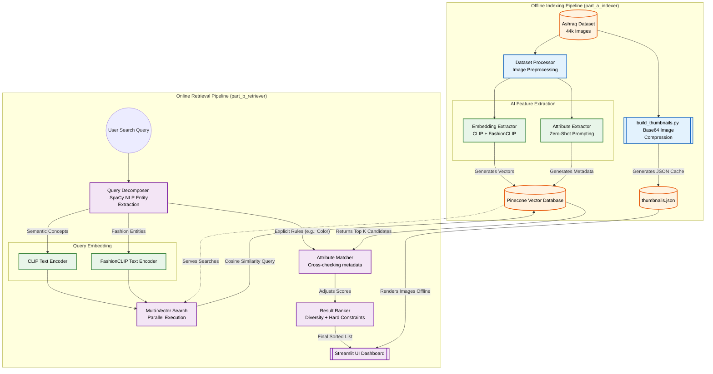

# Fashion Retrieval System: Project Workflow

This document illustrates the end-to-end data flow of the system. The architecture is strictly divided into two distinct pipelines: **Offline Indexing** (processing and storing the data) and **Online Retrieval** (handling user search queries in real-time).

## Complete Workflow Diagram

## Component Breakdown

### Part A: Offline Indexing
The offline process runs asynchronously to populate the database so that searches at runtime are nearly instantaneous.
1. **Dataset**: We pull ~44,000 images from the `ashraq/fashion-product-images-small` dataset.
2. **Thumbnails**: Because public image URLs break often, we generate a local base64 `thumbnails.json` cache. This ensures the Streamlit UI can render images 100% offline with zero latency.
3. **Embedding Extractor**: Each image is encoded into two distinct 512-dimension vectors—one by standard CLIP (for broad semantic understanding) and one by FashionCLIP (for domain-specific apparel understanding).
4. **Attribute Extractor (Zero-Shot)**: Instead of training classification models, we use CLIP to evaluate prompts (e.g., *"This is a formal outfit"*) against the image. The highest scoring prompts are attached to the Pinecone vector as searchable metadata.

### Part B: Online Retrieval
When a user types a query like *"red formal shirt for an office meeting"*:
1. **Query Decomposer**: SpaCy instantly parses the query to extract explicit constraints (Color = `red`, Item = `shirt`, Formality = `formal`, Setting = `office`).
2. **Parallel Search**: The query text is vectorized by both CLIP and FashionCLIP simultaneously. These vectors query their respective namespaces in Pinecone.
3. **Attribute Matcher & Ranker**: The system retrieves the top candidate images from Pinecone based purely on vector similarity. It then boosts the scores of items whose pre-computed metadata explicitly matches the constraints extracted by the Query Decomposer. Finally, hard constraints (e.g., dropping casual images for a formal search) are applied before sending the final ranked list to Streamlit.
