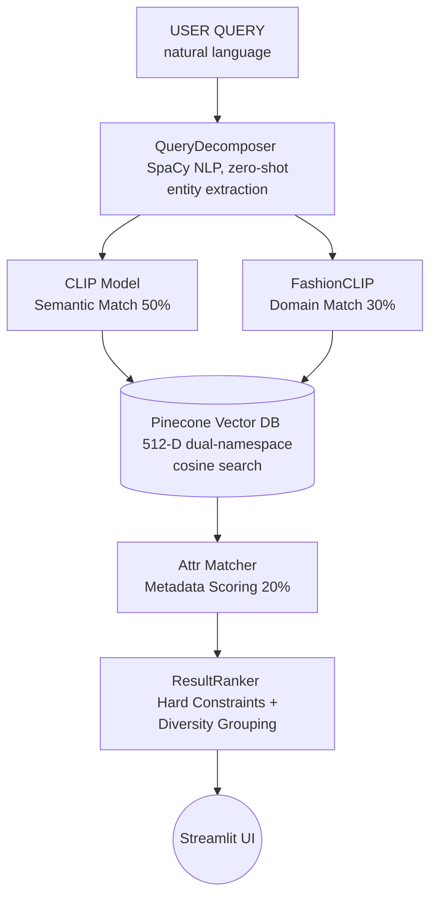

# Fashion Retrieval System

> **Multi-vector fashion image search using CLIP + FashionCLIP + zero-shot attribute decomposition**

An intelligent multimodal search engine that retrieves fashion images based on natural language descriptions. Unlike vanilla CLIP, this system understands **compositionality**, **fine-grained fashion attributes**, and **contextual awareness**.

---

## 🚀 Setup Guide

Follow these steps to get the system up and running on your local machine.

### 1. Prerequisites
Ensure you have Python 3.9+ installed. You will also need a free Pinecone account for the vector database.

### 2. Environment Setup
Clone the repository and set up a virtual environment:
```bash
git clone https://github.com/Charan512/Fashion-Search.git
cd Fashion-Search

# Create and activate virtual environment
python3 -m venv .venv
source .venv/bin/activate
```

### 3. Install Dependencies
Install the required packages and the core CLIP model from source:
```bash
pip install -e .
pip install git+https://github.com/openai/CLIP.git
python -m spacy download en_core_web_sm
```

### 4. Configure Secrets
The application requires a Pinecone API key to store and retrieve vectors.
1. Sign up at [Pinecone](https://www.pinecone.io/) and create a serverless index with **512 dimensions** and **cosine metric**.
2. Copy the `.env.example` file to `.env`:
   ```bash
   cp .env.example .env
   ```
3. Open `.env` and fill in your API key and the index name. By default, the system looks for an index named `fashion-retrieval`.

### 5. Build the Vector Index and Thumbnail Cache
The indexer will download 44,000 images from the `ashraq/fashion-product-images-small` e-commerce dataset, extract embeddings, and push them to Pinecone. 

```bash
# Build local thumbnail cache for fast, offline UI rendering (generates ~77MB thumbnails.json)
python3 scripts/build_thumbnails.py 44000

# Index 44,000 images into Pinecone (Run in background as this takes a few hours locally)
python3 -m part_a_indexer.index --subset 44000
```
*(Note: To guarantee lightning-fast UI rendering and zero broken image links, `build_thumbnails.py` generates a local `thumbnails.json` base64 cache so all 44,000 images load reliably offline.)*

### 6. Launch the Application
Start the interactive Streamlit dashboard:
```bash
streamlit run demo/app.py
```

---

## 🏗️ Architecture Overview

The system is split into two primary components: the offline indexer (Part A) and the online retriever (Part B).



### The "Fashion Attribute Pyramid" Scoring System
Results are ranked using a composite score based on three pillars:
1. **Semantic (50%)**: Global contextual match using OpenAI's CLIP (`ViT-B/32`).
2. **Fashion (30%)**: Domain-specific apparel match using `FashionCLIP`.
3. **Attribute (20%)**: Explicit metadata matching (Color binding, setting, formality, clothing type) extracted zero-shot during the indexing phase.

### ❓ Why Not Just Vanilla CLIP?
Vanilla CLIP fundamentally fails at fashion retrieval for a few key reasons:
- ❌ **Compositionality blindness**: `"red tie + white shirt"` vs `"white tie + red shirt"` resolve to identical vectors in standard CLIP. Our `QueryDecomposer` fixes this by binding colors to specific items syntactically.
- ❌ **Contextual ignorance**: It struggles to distinguish an office setting from a park. Our `AttributeMatcher` extracts explicit settings.
- ❌ **Formality violations**: You might ask for a "formal suit" and get a casual blazer. Our system uses "Hard Constraint Filtering" to drop casual images entirely when formal queries are detected.

---

## 📦 Project Structure

```text
Fashion-Search/
├── config.yaml                   # Centralized configuration
├── .env.example                  # Secrets template (copy → .env)
├── INTERVIEW_QNA.md              # Q&A covering architecture & problem-solving
├── requirements.txt              # Python dependencies
├── setup.py                      # Package setup
│
├── part_a_indexer/               # Offline indexing pipeline
│   ├── index.py                  # Main orchestrator (CLI)
│   ├── dataset_processor.py      # Loads ashraq/fashion-product-images-small
│   ├── embedding_extractor.py    # CLIP + FashionCLIP embedding
│   ├── attribute_extractor.py    # Zero-shot attribute extraction
│   └── vector_storage.py         # Pinecone interface
│
├── part_b_retriever/             # Online retrieval pipeline
│   ├── retriever.py              # FashionRetriever orchestrator
│   ├── query_processor.py        # QueryDecomposer (NLP parsing)
│   ├── multi_vector_search.py    # Parallel Pinecone querying
│   ├── attribute_matching.py     # AttributeMatcher
│   └── ranker.py                 # Diversity and constraint logic
│
├── demo/                         # Streamlit UI
│   ├── app.py                    # Entry point (Main Dashboard)
│   ├── thumbnails.json           # [Auto-generated] Base64 image cache
│   ├── pages/                    
│   │   ├── 01_Search.py          # Main search interface
│   │   ├── 02_Examples.py        # Evaluation queries showcase
│   │   └── 03_About.py           # Architecture overview
│   └── components/
│       ├── theme.py              # Custom CSS styling
│       ├── result_card.py        # Result display component
│       └── search_box.py         # Query input component
│
└── scripts/                      # Utility scripts
    └── build_thumbnails.py       # Builds local image cache
```

---

## 🔧 Configuration Options

Override values in `config.yaml` using `.env`:

| Variable | Default | Description |
|----------|---------|-------------|
| `PINECONE_API_KEY` | — | **Required** — your Pinecone API key |
| `PINECONE_INDEX_NAME` | `fashion-retrieval` | Target index name |
| `DATASET_SUBSET_SIZE` | `5000` | Number of images to index |
| `DEVICE` | `cpu` | Use `cpu` for M1/M2 Macs, `cuda` for Nvidia |

---

## 🧪 Testing

The codebase maintains a 91-test suite with full mock coverage (no Pinecone or GPU required).

```bash
# Run all tests
pytest -v --tb=short
```